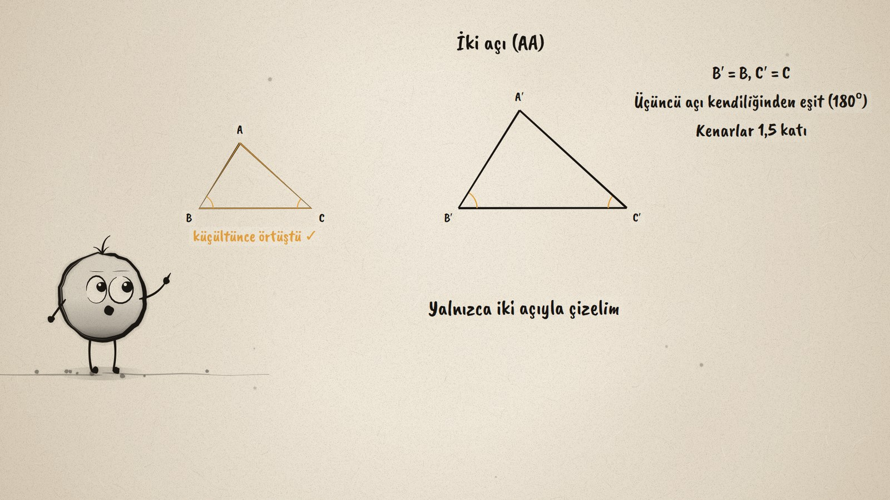
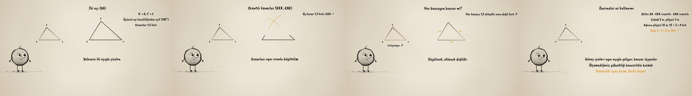

# Benzer Üçgen İçin Ne Yeter? · What Makes Triangles Similar

**▶ Tarayıcıda izleyin / Watch in the browser:** https://hakanatas.github.io/benzer-ucgen/ 
**⬇ MP4 + altyazılar / MP4 + subtitles:** [Releases](https://github.com/hakanatas/benzer-ucgen/releases) 
**✎ Kullanılan istem / The prompt behind it:** [PROMPT.md](PROMPT.md) 
**🎞 Bütün filmler / All films:** [Nokta'nın Filmleri](https://hakanatas.github.io/nokta-filmleri/?sinif=8)

> **TR —** 8. sınıf matematik "Geometrik Şekiller" temasındaki MAT.8.3.4 öğrenme çıktısı için hazırlanmış, tamamen JavaScript ile çizilen 92 saniyelik mürekkep animasyonu. Bir üçgenle aynı biçimde, 1,5 kat büyük bir üçgen çizmek için ne bilmek yeterli? Varsayım: açılar eşitse biçim aynı olur. Yalnızca iki açıyla (AA) çizilen üçgen küçültülünce asılla örtüşüyor; üçüncü açı kendiliğinden eşit. Üç kenarı aynı oranla büyütmek (KKK) ya da iki kenarı aynı oranla büyütüp aradaki açıyı korumak (KAK) da benzer üçgen veriyor. Ama her kenara 1,5 eklemek oranı bozuyor, tek bir açı da biçimi belirlemiyor. Önermeler sözle ifade ediliyor ve bir ağacın yüksekliği gölgelerden benzerlikle bulunuyor. Altyazılar Türkçe, İngilizce ya da ikisi birlikte seçilebilir.

A 92-second ink animation for **8th-grade maths**. Nokta, the ink character from [The Learning Ink](https://github.com/hakanatas/the-learning-ink), is the guide again. Each construction is built on the right at 1.5 times the size and then shrunk back onto the original on the left (`shrinkTest` in `scenes/scene1.js`), so "similar" is shown literally as a copy that, scaled down, lands exactly on the original, and "not enough" as one that does not.

## Learning outcome

MEB, Türkiye Yüzyılı Maarif Modeli, Ortaokul Matematik, 8th grade, "Geometrik Şekiller" theme:

**MAT.8.3.4. Bir üçgene benzer üçgen oluşturmak için üçgenle ilgili bilinmesi yeterli olan elemanlara dair çıkarım yapabilme**
- a) Bir üçgene benzer üçgen oluşturmak için üçgenle ilgili bilinmesi yeterli olan elemanlara dair varsayımda bulunur.
- b) Matematiksel araç ve teknoloji yardımıyla varsayımlarına uygun benzer üçgenler oluşturur.
- c) Oluşturduğu üçgenleri varsayımları ile karşılaştırır.
- ç) Bir üçgene benzer üçgen oluşturmak için üçgenle ilgili bilinmesi yeterli olan elemanlara dair önerme sunar.
- d) Önermesinin iki üçgenin benzer olup olmadığını incelemeye yönelik katkısını değerlendirir.

## Scenes

| # | Time | Scene | What happens | Outcome |
|---|---|---|---|---|
| 1 | 0–10 s | Aynı biçim | Same shape, 1.5 times bigger: what do we need to know? | a |
| 2 | 10–28 s | AA | Drawn from two angles only (AA): shrunk back, it fits. | b, c |
| 3 | 28–46 s | Orantılı kenarlar | Three sides scaled by 1.5 (SSS), two sides and the angle between (SAS): it fits. | b, c |
| 4 | 46–64 s | Yetmeyenler | Adding 1.5 to each side breaks the ratio; one angle alone fixes nothing. | b, c |
| 5 | 64–80 s | Gölge | AA, SSS, SAS in proportion; a tree's height from its shadow. | ç, d |
| 6 | 80–92 s | Özet | Same shape, different size. | a–d |

## Running it

- **Preview:** double-click `index.html` (it works offline).
- **MP4:** run `npm install` once, then `npm run export -- --format=horizontal --captions=tr`.
- **Subtitles and narration:** `npm run srt` writes `out/captions_*.srt` and `narration_notes.txt`.
- **Editing:**
  - Caption text, timings and narration notes: `captions.js`
  - Everything on screen is drawn by `LI.world(t)` in `scenes/scene1.js` (the triangles, the arcs, the copies, the words); the other scenes only set the camera.
  - Nokta's poses: `src/draw/film.js`; layout for 16:9 and 9:16: `src/draw/kd.js`

It uses the same engine as The Learning Ink: `renderFrame(t)` as a pure function of time, seeded randomness, and frame-by-frame export.
